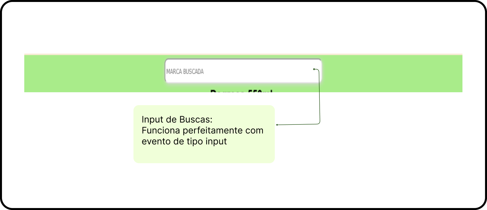
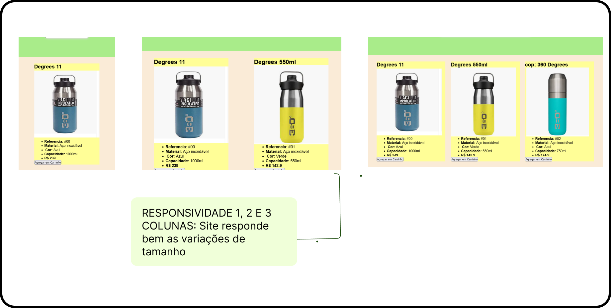

# BUGS LIST
documentação para listar problemas iniciais com o template base próprio cheio de bugs, esse é o inicio do primeiro projeto que busca transformar em um belo front-end para exibição de books (posts com material educativo de programação feito com os aprendizados do semestre), esta é somente a primeira ideia para organizar o conhecimento em forma similar a flash cards.

PAGINA /public/index.html

PONTOS POSITIVOS DA PÁGINA:

<ul style="display: flex; flex-flow: column wrap; align-items: center; justify-content: space-around; margin: 30p;x auto; list-style-type: none;">
<li>
<h2>PONTO POSITIVO #01</h2>
  
</li>
<li>
<h2>PONTO POSITIVO #02</h2>
  
</li>
<li> PONTO POSITIVO #04 : O BOTÃO para ADD CART Funciona apesar da estetica horrenda</li>
</ul>